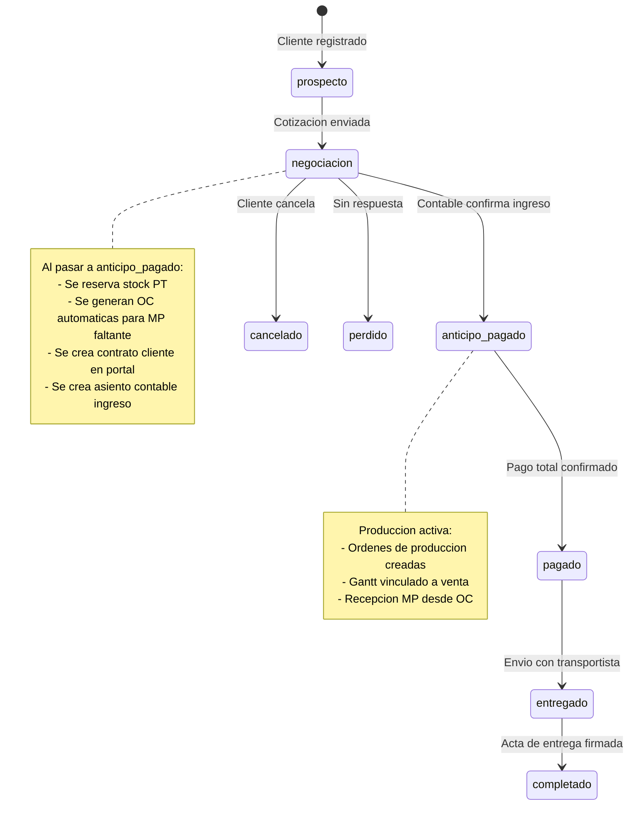
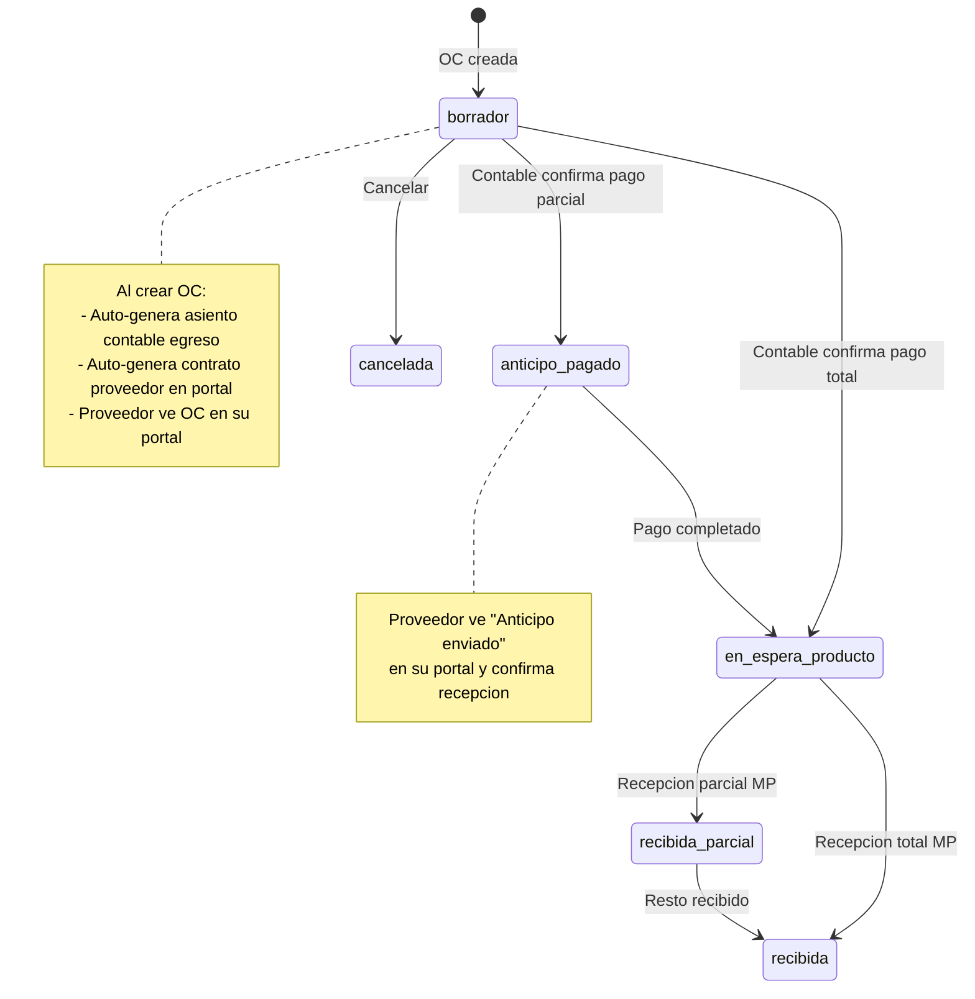
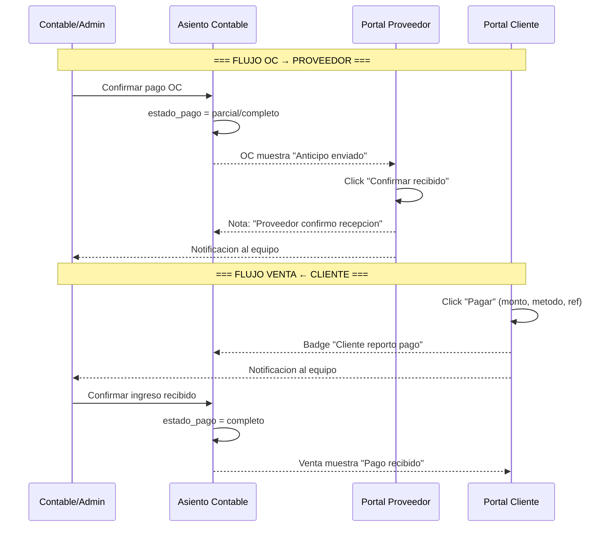
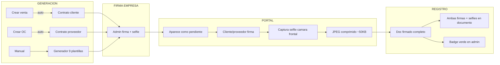
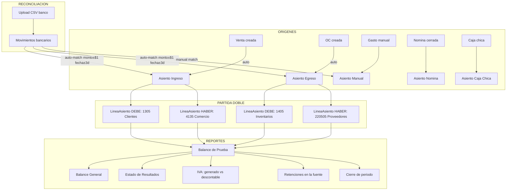
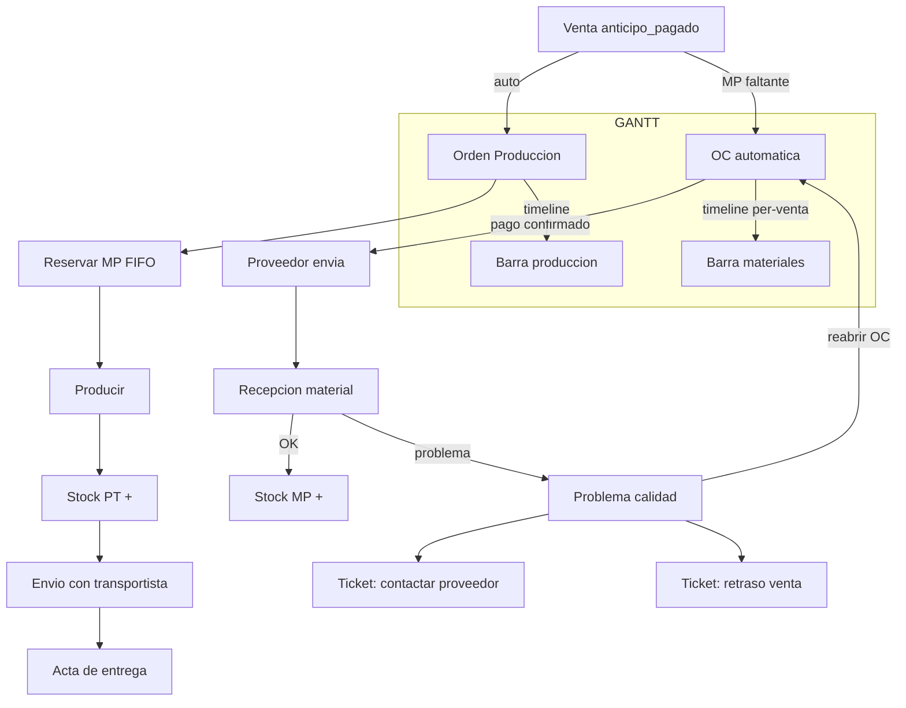
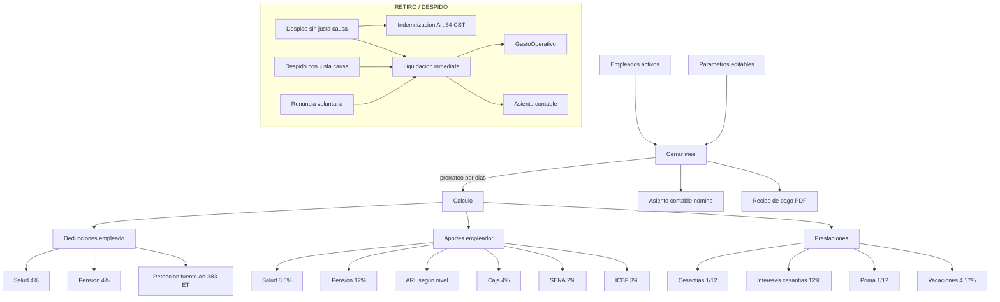
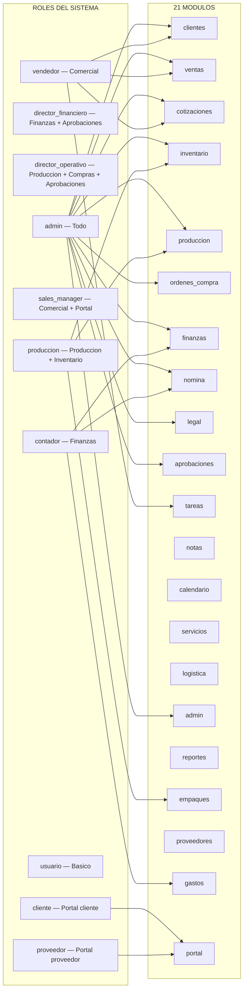

# Diagrama de Flujo Completo — Evore CRM v40

## 1. Flujo General del Sistema

```mermaid
flowchart TB
    subgraph PORTAL_CLI["PORTAL CLIENTE"]
        PC_inicio[Dashboard cliente]
        PC_precot[Nueva solicitud]
        PC_pago[Reportar pago enviado]
        PC_docs[Documentos legales]
        PC_firma[Firma digital + selfie]
        PC_msg[Mensajes]
    end

    subgraph PORTAL_PROV["PORTAL PROVEEDOR"]
        PP_inicio[Dashboard proveedor]
        PP_confirmar[Confirmar OC]
        PP_anticipo[Confirmar anticipo recibido]
        PP_docs[Documentos legales]
        PP_firma[Firma digital + selfie]
        PP_msg[Mensajes]
    end

    subgraph COMERCIAL["COMERCIAL"]
        CLI[Clientes]
        COT[Cotizaciones]
        VNT[Ventas]
        SRV[Servicios]
        PROD_CAT[Productos]
    end

    subgraph COMPRAS["COMPRAS"]
        PROV[Proveedores]
        COT_PROV[Cotizaciones proveedor]
        OC[Ordenes de compra]
        REG_COMPRAS[Registro compras MP]
    end

    subgraph PRODUCCION["PRODUCCION"]
        REC[Recetas / BOM]
        OP[Ordenes produccion]
        GANTT[Gantt por venta]
        RECEPCION[Recepcion material]
        CALIDAD[Control calidad]
    end

    subgraph INVENTARIO["INVENTARIO"]
        INV_PT[Stock productos terminados]
        INV_MP[Stock materias primas]
        LOTES[Lotes con vencimiento]
        MOV[Movimientos inventario]
    end

    subgraph FINANZAS["FINANZAS / CONTABLE"]
        PUC[Plan Unico de Cuentas]
        ASI[Asientos contables]
        ASI_GEN[Generados - OC/Ventas]
        ASI_MAN[Manuales - Caja chica]
        CONC[Reconciliacion bancaria]
        IVA[IVA generado vs descontable]
        RET[Retenciones]
        BAL[Balance general]
        RES[Estado de resultados]
        CIERRE[Cierre de periodo]
    end

    subgraph NOMINA["NOMINA"]
        EMP[Empleados]
        NOM_MES[Cierre mensual]
        PARAMS[Parametros editables]
        LIQ[Liquidaciones]
        RECIBO[Recibos de pago]
    end

    subgraph LEGAL["LEGAL"]
        DOC_LEG[9 plantillas colombianas]
        GEN_DOC[Generador de documentos]
        FIRMA_EMP[Firma empresa]
        FIRMA_PORT[Firma portal + selfie]
        REG_DOC[Registro documentos]
    end

    subgraph ADMIN["ADMINISTRACION"]
        USR[Usuarios y roles]
        CFG[Config empresa]
        APROB[Aprobaciones]
        TICK[Tickets]
        NOTAS[Notas]
        CAL[Calendario]
        WIKI[Wiki del sistema]
    end

    %% ═══ FLUJOS PRINCIPALES ═══

    CLI -->|crea| COT
    COT -->|aprueba| VNT
    VNT -->|auto-genera| ASI_GEN
    VNT -->|auto-genera| DOC_LEG
    VNT -->|anticipo confirmado| OP
    VNT -->|MP faltante| OC

    PROV --> COT_PROV
    COT_PROV --> OC
    OC -->|auto-genera| ASI_GEN
    OC -->|auto-genera| DOC_LEG
    OC --> REG_COMPRAS

    OP --> REC
    OP --> GANTT
    REC --> INV_MP
    RECEPCION --> INV_MP
    RECEPCION --> LOTES
    OP -->|completada| INV_PT

    ASI_GEN -->|confirmar pago| OC
    ASI_GEN -->|confirmar ingreso| VNT
    ASI --> PUC
    ASI --> BAL
    ASI --> RES
    CONC --> ASI

    DOC_LEG --> PC_docs
    DOC_LEG --> PP_docs
    PC_firma --> DOC_LEG
    PP_firma --> DOC_LEG

    PC_pago -->|notifica| ASI_GEN
    PP_anticipo -->|actualiza| ASI_GEN

    EMP --> NOM_MES
    PARAMS --> NOM_MES
    NOM_MES --> ASI
    LIQ --> ASI

    CALIDAD -->|problema| TICK
    CALIDAD -->|retraso| TICK
```



## 2. Ciclo de Vida de una Venta



## 3. Ciclo de Vida de una Orden de Compra



## 4. Flujo Bidireccional de Pagos



## 5. Flujo de Documentos Legales



## 6. Flujo Contable Colombiano



## 7. Flujo de Produccion



## 8. Flujo de Nomina Colombiana



## 9. Mapa de Roles y Permisos



## 10. Arquitectura de Archivos

```
evore-crm/
├── app.py                    # Flask factory + error handlers
├── extensions.py             # db, login_manager, mail singletons
├── models.py                 # 51 modelos + init_db() + migraciones
├── utils.py                  # Decoradores, filtros, constantes nomina
├── company_config.py         # Multi-empresa (CO/MX)
├── routes/
│   ├── __init__.py           # register_all()
│   ├── auth.py               # Login, logout, demo, onboarding
│   ├── dashboard.py          # Home, reportes, calendario, notificaciones
│   ├── clientes.py           # CRUD clientes + contactos
│   ├── ventas.py             # Ventas, cotizaciones, estados, PDFs
│   ├── compras.py            # OC, cotizaciones proveedor
│   ├── produccion.py         # Ordenes, recetas, gantt, recepcion MP
│   ├── inventario.py         # Productos, lotes, import masivo
│   ├── contable.py           # Asientos, PUC, balances, IVA, reconciliacion
│   ├── nomina.py             # Empleados, cierre, liquidacion, parametros
│   ├── admin.py              # Usuarios, legal, gastos, impuestos
│   ├── portal.py             # Portal cliente + proveedor + firma docs
│   ├── aprobaciones.py       # Workflow aprobaciones
│   ├── tareas.py             # Tickets
│   ├── notas.py              # Notas vinculadas
│   ├── empaques.py           # Empaque, simulador logistica
│   ├── servicios.py          # Catalogo servicios
│   ├── proveedores.py        # CRUD proveedores
│   └── api.py                # Busqueda global, health, AI
├── services/
│   ├── inventario.py         # Stock FIFO, reservas, lotes
│   └── nomina.py             # Calculo nomina CO/MX
├── templates/                # 135+ templates Jinja2
│   ├── base.html             # Dock sidebar + workspace tabs + onboarding
│   ├── portal_base.html      # Layout portal cliente/proveedor
│   └── [24 carpetas por modulo]
└── static/                   # Assets estaticos
```

## 11. Integraciones y Automatizaciones

| Trigger | Accion automatica |
|---------|------------------|
| Crear venta | Asiento contable ingreso + contrato cliente en portal |
| Crear OC | Asiento contable egreso + contrato proveedor en portal |
| Confirmar pago OC (contable) | OC → anticipo_pagado, proveedor ve "anticipo enviado" |
| Proveedor confirma anticipo | AsientoContable nota + notificacion equipo |
| Cliente reporta pago (portal) | PagoVenta + notificacion contable + badge en asiento |
| Confirmar ingreso (contable) | Venta → anticipo_pagado + reservar stock + generar OC auto |
| Venta anticipo_pagado | Stock reservado + OC auto para MP faltante |
| Recepcion MP (produccion) | Stock MP + + LoteMateriaPrima + MovimientoInventario |
| Problema calidad | 2 tickets auto (compras + ventas) + score proveedor |
| Despido/retiro empleado | Liquidacion + GastoOperativo + AsientoContable inmediato |
| Nomina sin cerrar dia 5 | Ticket automatico al admin |
| Documento firmado portal | Notificacion admin + badge "firmado" en registro |
| Upload CSV banco | MovimientoBancario + auto-match con asientos |

## 12. Stack Tecnologico

| Componente | Tecnologia |
|------------|-----------|
| Backend | Python 3.11 + Flask 3.x |
| ORM | SQLAlchemy + Flask-SQLAlchemy |
| DB produccion | PostgreSQL (Railway) |
| DB desarrollo | SQLite |
| Auth | Flask-Login + bcrypt |
| Templates | Jinja2 server-side |
| CSS | Bootstrap 5.3 + variables CSS custom |
| Icons | Bootstrap Icons |
| UI | Dock sidebar + iframe workspace tabs |
| Deploy | Railway.app (Gunicorn) |
| AI | OpenAI → Anthropic → Ollama (fallback chain) |
| Pais | Colombia (PUC, CST, Ley 100) / Mexico (CUC, IMSS) |
